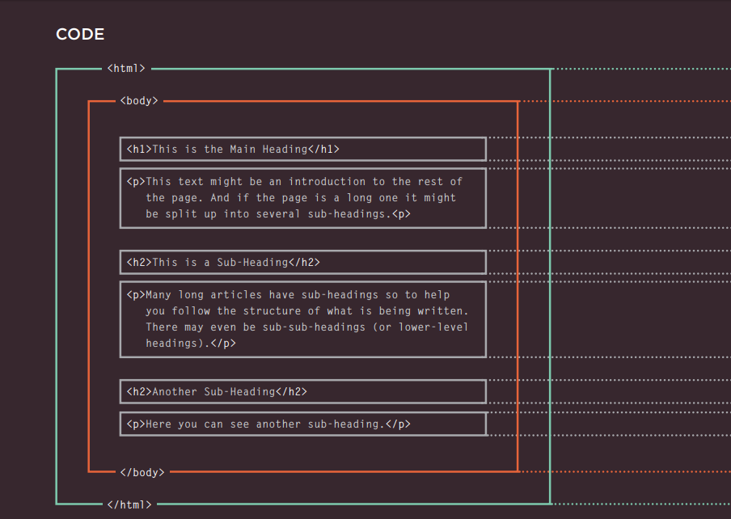

# This page will include the  read-01 
## Read-01
### Introduction : First how the web works?
when any user visit any random website there is a hidden process between browsers ,server and you as a client.

### Structure of HTML:
HTML Uses Elements to Describe the Structure of Pages:
this image will show you what meant by structure of the html 
 
- 
 is the opening tag.
- 
 is the closing tag .
 #### Attributes give us more information about each element  
 

